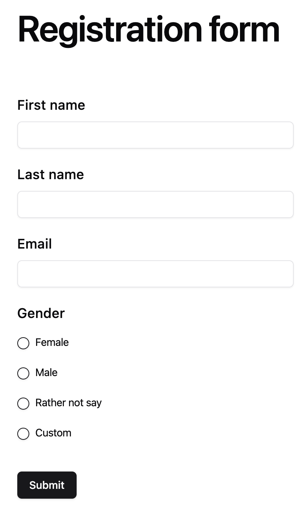

<h1 align="center">FS University</h1>

<h2 align="center">Professional form builder for educational institutions</h2>

The ultimate service for creating multiple forms in record time

 
 

## Demo

[FS University Demo](https://fsuniversity.vercel.app/)

Our form builder is designed for educational institutions. It provides a professional and reliable solution for creating forms and collecting responses.

## ⭐️ Why FS University?

FS University is a professional form builder designed specifically for educational institutions. It empowers educators and administrators to create comprehensive forms, surveys, and assessments with ease. Our platform offers advanced features for academic use while maintaining simplicity and reliability. Choose FS University for professional, secure, and efficient form creation tailored for education.

## ☁️ Self Host

FS University can be easily self-hosted for complete control and privacy. We recommend using Vercel for hosting the Next.js application and a PostgreSQL database (such as Supabase or Railway) for data storage.
Both platforms offer generous free tiers, making it cost-effective to host your own instance of FS University 🤑.

In vercel I got 4 enviroments variables

For the first two check this guide: [Supabase guide to connect prisma](https://supabase.com/partners/integrations/prisma)

Actually, we use DATABASE_URL and DIRECT_URL because Vercel use serverless. But you can adapt the code to just use DATABASE_URL if you host nextjs in a not serverless enviroment like [Render](https://render.com/). For more info check [Prisma Docs](https://www.prisma.io/docs/concepts/database-connectors/postgresql)

For more info about the nextauth enviroments check [NextAuth Docs](https://next-auth.js.org/configuration/options)

- DATABASE_URL
- DIRECT_URL
- NEXTAUTH_URL: fsuniversity.vercel.app
- NEXTAUTH_SECRET: very-secret-password

I will try to create a docker image in the future 🙂

## 🚀 Have a feature request?

For new feature requests, create an issue explaining what you want and why you need it.

## 💻 Need Help?

If you need help, please post your questions in the 'issues' section of the repository.

## Development commands

## Prisma

### Update db

npx prisma db push
npx prisma generate

### db migrate

npx prisma migrate dev --name init

### run seeds

npx prisma db seed

### Prisma Studio

npx prisma studio

### Prisma reset database

npx prisma migrate reset
